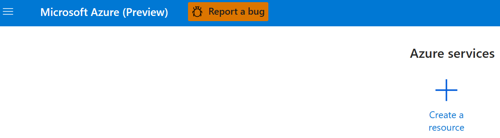
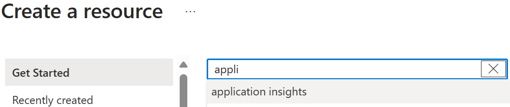
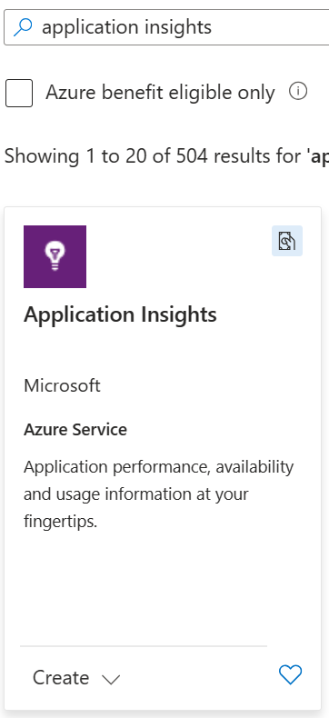

# Azure connection string of an Application Insights resource

You can create an Application Insights resource in this way in the Azure portal:

After creating the resource, [you can find the connection string in the Azure portal](https://learn.microsoft.com/en-us/azure/azure-monitor/app/sdk-connection-string?tabs=dotnet5#find-your-connection-string).

