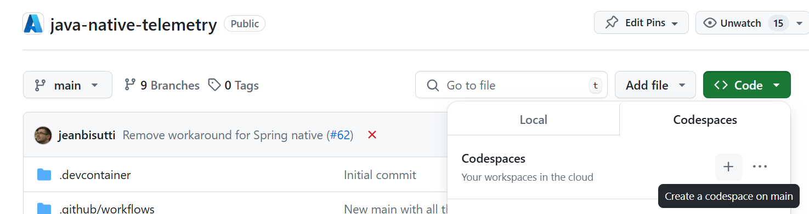

# Telemetry for GraalVM native images

This repository contains code demonstrating how to enable OpenTelemetry features for GraalVM native images on Azure:
* [Spring Boot](./code/spring-boot-telemetry/README.md)
* [Quarkus](./code/quarkus-telemetry/README.md)

## Run the Code

Since native apps are built for the machine it runs on, make sure you execute this on a unix machine.
Feel free to clone the repository locally when you are using Linux or MacOS.
For Windows further adjustments might be neccessary.

### We recommend to use CodeSpaces.

To ensure the machine type you're running on, fork the repository and then select `Create a codespace on main` by clicking on the `+` icon.

The [.devcontainer file](.devcontainer/devcontainer.json) holds all dependencies needed to run the code 'locally' on a linux machine.

The first start might take a few minutes. Every restart is consiberably fast.
