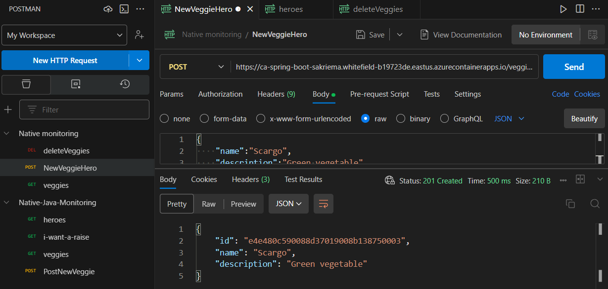
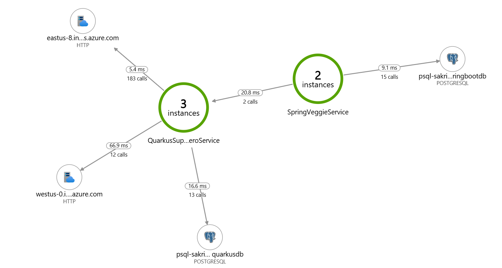
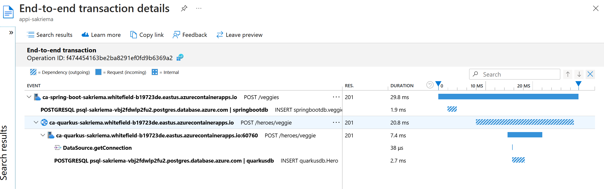

# Telemetry for GraalVM native images

This repository contains code demonstrating how to enable OpenTelemetry features for GraalVM native images on Azure:
* [Spring Boot](./code/spring-boot-telemetry/README.md)
* [Quarkus](./code/quarkus-telemetry/README.md)

Setup the infrastructure, and deploy the sample to Azure Container Apps with [azd](https://learn.microsoft.com/azure/developer/azure-developer-cli/).
We'll make use of bicep files that you find and update [here](./infra). To provide Infrastructure as Code for Azure, Terraform or Bicep files are recommended. Learn more about Bicep [here](https://learn.microsoft.com/en-us/azure/azure-resource-manager/bicep/overview?tabs=bicep).

```bash
 # Login to Azure
 azd auth login --use-device-code
 
 # Provision the Infrastructure with the Region and ShortCut set for namings
 azd provision

 # Deploy the apps
 azd up
```

Create some traffic, for instance with Postman:



The Application Map in Azure Application Insights will look like this:



And give you traces like:



Delete all resources with `azd down` afterwards.

